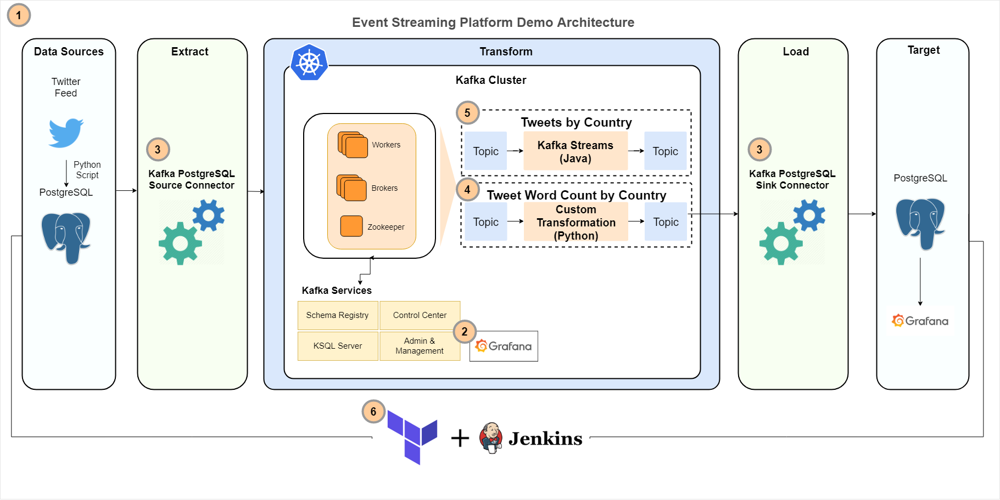

# Kafka Platform demonstration

## Prerequisites

- Docker with Kubernetes (standard on Mac and Windows)
- helm [link](https://helm.sh/)
- terraform [link](https://www.terraform.io/)
- jq (for parsing kubectl responses) [link](https://stedolan.github.io/jq/)
- git (for getting Confluent helm charts)

## Installation

### Prep

1. Get your local Kubernetes up and running
2. Test it with `kubectl cluster-info`
3. `terraform -chdir=terraform init`
4. `make kube.proxy` and keep it running on the side

### Provisioning

1. `make provision`

### Destroying

1. `make tf.destroy`

### Grafana
You can see a live Counts dashboard in Grafana.

1. `make grafana.open`. User: admin, password is in your clipboard.

### Kube dashboard (optional)

1. Install the dashboard (it's purposefully not part of the solution):

`helm repo add kubernetes-dashboard https://kubernetes.github.io/dashboard/`

`helm install kube-dashboard kubernetes-dashboard/kubernetes-dashboard`

2. `make dashboard.open`. This will open the web app and put the token in your clipboard
3. Use the token from your clipboard

## Accessing services

### Control Center UI

1. `make control-center.open`

### Jenkins

1. Wait a few minutes for the service to come up
2. `make jenkins.open`
3. `make jenkins.password`
4. Log in with user admin and password from the output above

### Console consumer for Twitter feed

1. `make consumer.twitter`
